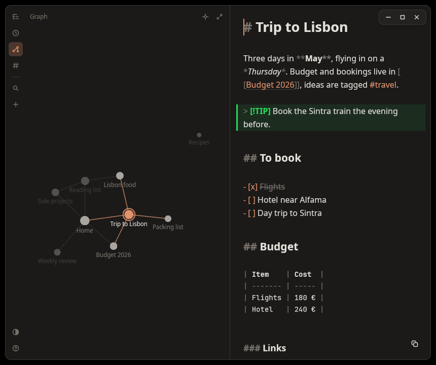

# encre

A fast, minimal note-taking app. Notes are plain Markdown files in a folder you choose, styled as you type. Written in Rust with [GPUI](https://www.gpui.rs), the GPU-accelerated UI framework behind Zed.


[Features](#features) · [Install](#install) · [First run](#first-run) · [Using encre](#using-encre) · [Navigation](#navigation) · [Markdown](#markdown) · [Notes and vault](#notes-and-vault) · [Compatibility](#compatibility) · [Troubleshooting](#troubleshooting) · [How it works](#how-it-works) · [Development](#development)

## Features

- **Opens instantly**: the window is on screen in about 75 ms on the author's machine.
- **Plain files**: one `.md` file per note, in a folder (the *vault*) you can sync with git, Syncthing or anything else. An existing Obsidian vault works as is.
- **Styled as you type**: headings grow, bold and italic render, markers stay visible but dimmed. The file on disk is always plain Markdown.
- **Lists that continue themselves**: `- `, `1. ` and `[] ` start a list, Enter continues it, numbering stays in order.
- **Links between notes**: `[[` suggests your notes; a link to a note that does not exist creates it. `#tags` filter the note list.
- **Three ways around your notes**: the vault as a tree, the notes you opened last, and a graph of the links between them, in a panel that folds down to a thin rail of icons.
- **Keyboard first**: one palette to find, create and switch notes, and a shortcut for every view. No toolbar.
- **No save button**: notes are written to disk as you type, and named after their first line.
- Light and dark, following your system. English and French, following the system language.

## Install

| Your system | Go to |
|---|---|
| Arch Linux | [Arch](#arch-linux) |
| Ubuntu, Linux Mint, Debian | [Ubuntu, Linux Mint, Debian](#ubuntu-linux-mint-debian) |
| Fedora | [Fedora](#fedora) |
| Another Linux distribution | [Other distributions](#other-distributions) |
| macOS | [macOS](#macos) |
| Windows | [Windows](#windows) |

On Arch there is a prebuilt package; everywhere else encre is compiled on your machine, which takes a few minutes the first time. Compiling needs a recent stable Rust: install it with [rustup](https://rustup.rs) if `rustc --version` shows less than 1.88.

### Arch Linux

Every release ships a ready-to-install package (no compiler needed), which pacman then tracks as `encre`. The package is not signed, so download it first: given a URL, pacman looks for a `.sig` file and warns when there is none.

```bash
curl -LO https://github.com/alarboulletmarin/encre/releases/latest/download/encre-x86_64.pkg.tar.zst
sudo pacman -U ./encre-x86_64.pkg.tar.zst
```

To follow `main` instead, build the development package from a checkout (needs `cargo` and `git`, it conflicts with `encre`):

```bash
git clone https://github.com/alarboulletmarin/encre.git
cd encre/aur/encre-git
makepkg -si
```

Or build the latest tagged release yourself with `makepkg -si` from the repository root. Not on the AUR yet.

### Ubuntu, Linux Mint, Debian

1. Install the build tools and libraries:

   ```bash
   sudo apt install build-essential pkg-config libfontconfig-dev libfreetype-dev \
     libwayland-dev libxcb1-dev libxkbcommon-dev libxkbcommon-x11-dev libvulkan1
   ```

2. Install Rust with [rustup](https://rustup.rs); the `cargo` from apt is usually too old.

3. Build and install:

   ```bash
   git clone https://github.com/alarboulletmarin/encre.git
   cd encre
   make
   sudo make install
   ```

### Fedora

Same steps as above, with these packages (names not tested):

```bash
sudo dnf install gcc pkgconf-pkg-config fontconfig-devel freetype-devel \
  wayland-devel libxcb-devel libxkbcommon-devel libxkbcommon-x11-devel vulkan-loader
```

### Other distributions

You need the development files of fontconfig, freetype, Wayland, libxcb and libxkbcommon (with its X11 part), a Vulkan driver for your GPU, and Rust. Then:

```bash
make                    # cargo build --release --locked
sudo make install       # PREFIX=/usr/local by default, PREFIX=/usr for a system-wide install
```

`make install` adds the `encre` command, an entry in your application menu and its icon. `sudo make uninstall` removes them.

### macOS

Needs Xcode (the full app, for the Metal shader compiler) and Rust.

```bash
git clone https://github.com/alarboulletmarin/encre.git
cd encre
cargo install --path . --locked
```

This installs the `encre` command in `~/.cargo/bin`. There is no `.app` bundle yet: start it from a terminal.

### Windows

Needs the Visual Studio C++ build tools with the Windows SDK, and Rust (MSVC toolchain).

```powershell
git clone https://github.com/alarboulletmarin/encre.git
cd encre
cargo install --path . --locked
```

This installs `encre.exe` in `%USERPROFILE%\.cargo\bin`. There is no installer yet.

### Upgrading

| Installed with | Upgrade |
|---|---|
| Arch, prebuilt package | run the two commands above again |
| Arch, `encre-git` | `git pull`, then `makepkg -si` in `aur/encre-git` |
| `make install` | `git pull`, then `make` and `sudo make install` |
| `cargo install` | `git pull`, then `cargo install --path . --locked` |

## First run

encre asks for a **vault**: the folder that holds your notes. Pick an existing folder, or create a new one from the file dialog. That is the only setup.

The choice is remembered, along with the last note you had open. Change vault at any time with `Ctrl + O`.

On Linux, give it a keyboard shortcut if you want it one key away: bind the command `encre` in your desktop settings (GNOME: Settings → Keyboard → Custom Shortcuts).

## Using encre

Start typing: the first line is the title of the note, and the name of its file.

On macOS, read `Cmd` for `Ctrl`, and `Alt` for `Ctrl` when moving by word.

| Key | Action |
|---|---|
| `Ctrl + P` | palette: find a note, create one, filter by `#tag` |
| `Ctrl + N` | new note |
| `Ctrl + E`, `Ctrl + R`, `Ctrl + G` | [navigation panel](#navigation): vault tree, recent notes, graph |
| `Ctrl + M` | navigation panel on the whole window, and back |
| `Ctrl + O` | change vault |
| `Ctrl + Shift + C` | copy the whole note (also the icon at the bottom right) |
| `Ctrl + click` | open a `[[link]]`, a `#tag` or a URL |
| `F1`, `Ctrl + /` | the list of shortcuts, inside the app |
| `Ctrl + Q` | quit |

In the palette, type to search; `Enter` opens the selected note. If no note has that name, the last row creates it. Typing `#` lists the notes carrying a tag.

| Key | While editing |
|---|---|
| `Enter` | continue the list; on an empty item, leave the list |
| `Tab`, `Shift + Tab` | indent, outdent (the selected lines, or the current list item) |
| `Ctrl + Enter` | check or uncheck a task; turn a bullet into a task |
| `Ctrl + B`, `Ctrl + I` | bold, italic |
| `Ctrl + Z`, `Ctrl + Shift + Z` | undo, redo |
| `Ctrl + ←` `→`, `Ctrl + Backspace` | move, delete by word |
| `Ctrl + Home` `End` | start, end of the note |
| `Ctrl + A` `C` `X` `V` | select all, copy, cut, paste |


## Navigation



A rail of icons stays on the left of the window. It opens a panel beside the note, in one of three views:

| View | Key | Shows |
|---|---|---|
| Tree | `Ctrl + E` | the vault and its folders; the open note is highlighted |
| Recent | `Ctrl + R` | every note, from the most to the least recently opened |
| Graph | `Ctrl + G` | one dot per note, one line per `[[link]]` between two notes |

The same keys work in the three views:

| Key | Action |
|---|---|
| `↑` `↓`, or a click | select a note and preview it beside the panel |
| `Enter`, or a double click | open the note and start typing |
| `←` `→` | tree: fold or unfold a folder; graph: move to the nearest note on that side |
| `Tab` | graph: walk through the notes linked to the selected one |
| `Esc` | back to the note |
| `F2`, `Delete` | tree and recent: rename the selected line, move it to the trash |
| `Ctrl + Shift + N` | new folder, next to the selected line of the tree |

A previewed note only counts as opened, and moves to the top of the recent list, once you click or type in it.

- **Sizes**: drag the line between the panel and the note. Dragged all the way left, the panel folds back to its rail; all the way right, it takes the whole window. Double-click the line for the default width. `Ctrl + M`, or the arrows button at the top of the panel, also switches to the whole window and back.
- **Folding**: pressing the key of the view on display, or clicking its icon, folds the panel. The rail stays, with the three views, search, new note and help one click away.
- **Graph**: drag the background to move around and scroll to zoom. Pointing at a note lights up the notes it is linked to. The target button fits the whole graph in view. With the graph on the whole window, a click only selects: `Enter` or a double click brings the note back.
- **New note from the tree**: with the tree on display, `Ctrl + N` creates the note in the folder of the selected line.
- **Right click** on a line for its menu: open, new note here, new folder, copy the `[[link]]`, rename, move to the trash. A right click below the last line acts on the vault itself.
- **Drag and drop**: in the tree, drag a note or a folder onto a folder to move it there, or below the last line to move it to the top of the vault. Nothing is ever overwritten: if the name is taken, the move is refused.
- **Renaming** a note whose first line is its name rewrites that line too, so both stay in step. `[[links]]` to the old name are not updated.
- **The trash** is the hidden folder `.trash` at the top of the vault: deleting moves the note or the folder there, and never destroys anything. Empty it, or take a note back, with your file manager.

encre reopens with the panel as you left it.

## Markdown

What you type is what is saved. encre only changes how it looks.

| Type | You get |
|---|---|
| `# `, `## `, `### ` | headings |
| `- `, `* `, `+ ` | a bullet list |
| `1. ` | a numbered list, renumbered as you add, remove or indent items |
| `[] ` or `- [ ] ` | a task; click the box or press `Ctrl + Enter` to check it |
| `> ` | a quote |
| `` ``` `` then `Enter` | a code block, closed for you |
| `---` | a divider |
| `**bold**`, `*italic*`, `~~struck~~`, `` `code` `` | inline styles |
| `[[Note name]]` | a link to another note, with suggestions as you type |
| `#tag` | a tag, usable as a filter in the palette |
| `https://…` | a link, opened in your browser |

Tables, images and footnotes are kept as you typed them, without special rendering.

## Notes and vault

- A vault is an ordinary folder. Notes in subfolders are found too; hidden folders (`.git`, `.obsidian`…) are ignored. New notes are created at the top of the vault, or in the selected folder when the tree is on display.
- A note is saved shortly after you stop typing, and when you switch note or quit. Saving is atomic: a crash never leaves a half-written file.
- A new note is named after its first line: `# Groceries` becomes `Groceries.md`, and the file is renamed when you change that line. A note whose file name did not already match its first line (typical of an existing vault) is never renamed.
- `[[Groceries]]` finds the note by file name, in any subfolder, ignoring case.
- The vault and the notes you opened, most recent first, are remembered in a small text file (and the navigation panel in a file named `layout` next to it):

  | System | File |
  |---|---|
  | Linux | `~/.config/encre/config` |
  | macOS | `~/Library/Application Support/encre/config` |
  | Windows | `%APPDATA%\encre\config` |

## Compatibility

| System | Status |
|---|---|
| Linux, GNOME on Wayland | first-class: this is what encre is built and used on (Arch Linux) |
| Linux, other desktops, Wayland or X11 | should work, with the same built-in title bar. Not tested |
| macOS, Windows | built and tested by CI on every commit; not used day to day by the author |

- **Linux** needs a working Vulkan driver (Mesa or the vendor one). encre draws its own title bar, as Zed does: GNOME under Wayland draws none for applications. On macOS and Windows the system title bar is used.
- **Language**: French if the system language is French, English otherwise. On Windows it is always English for now.
- **Fonts**: encre picks Inter, Noto Sans, Segoe UI or Helvetica Neue, whichever is installed, and JetBrains Mono, Menlo or Consolas for code.

## Troubleshooting

**The window takes two seconds to open (Linux).** Another Vulkan driver is slow to load. encre already skips the NVIDIA one when the machine has no NVIDIA card. To check what remains, run `VK_LOADER_DEBUG=driver encre` in a terminal.

**The window does not open, with an error about a surface or an adapter.** No usable Vulkan driver: install the one for your GPU (`vulkan-intel`, `vulkan-radeon`, `nvidia-utils`… on Arch; `mesa-vulkan-drivers` on Ubuntu).

**Bold text is not bold.** The font in use is a variable font, which the text engine cannot embolden. Install Inter or Noto Sans.

**A note was not renamed after I changed its title.** Either another note already has that name, or the file name did not match the first line to begin with, see [Notes and vault](#notes-and-vault).

**I edited a note in another program while it was open in encre.** encre does not watch files: it keeps its own version and writes it back on the next edit. Switch to another note and back to reload it from disk.

**Limits.** The name field of a new folder or a rename only edits at its end: type, or erase with Backspace. Renaming a note does not update the `[[links]]` pointing to it. No full-text search: the palette matches note names and tags.

## How it works

- **Editor**: a custom text element drawn directly with GPUI's text system. Each line is classified (heading, list item, quote, code…) and shaped with its own size and style runs; the text itself is never transformed.
- **Typing rules** (`src/markdown.rs`): pure functions decide what Enter and Tab do on a line and renumber the list around the cursor. They are unit-tested without any UI.
- **Vault** (`src/vault.rs`): the note list and its tags are indexed off the UI thread when the vault opens, then kept up to date on each save.
- **Palette**: substring matches first, ranked by position, then subsequence matches; ties keep the most recently opened note first.
- **Navigation** (`src/nav.rs`): the tree is rebuilt from the paths of the indexed notes, and only the visible rows are drawn. 
- **Graph** (`src/graph.rs`): a force-directed layout computed off the UI thread when the links change, then drawn as plain lines and discs. Links to notes that do not exist yet are left out.
- **Startup**: the last note is read before the first frame, so the window appears with its content. Icons are embedded in the binary.
- **Window**: on Linux encre draws its own title bar, shadow and resize edges (client-side decorations); on macOS and Windows the system does.

## Development

```bash
cargo run                 # debug build
cargo run --release       # what gets installed
make test                 # cargo test --locked
```

The tests include an end-to-end run driven by simulated keystrokes (typing, lists, autosave, palette, links, navigation panel, file operations), using GPUI's test platform: no display needed.

`Cargo.lock` started as a copy of the one GPUI 0.2.2 was published with: newer versions of some of its dependencies no longer build together. Update dependencies one at a time.

Releasing (maintainer): `scripts/release.sh X.Y.Z` bumps the version, tags, pushes, creates the GitHub release (the Arch package is attached by `.github/workflows/arch-package.yml`) and pins the PKGBUILD checksum.

## License

MIT
